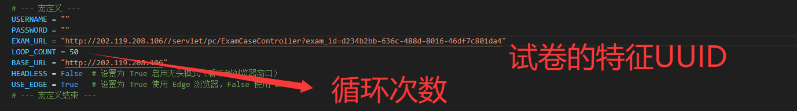
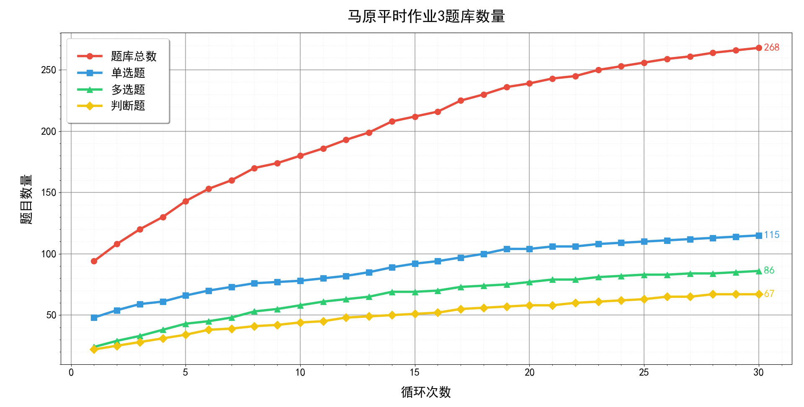
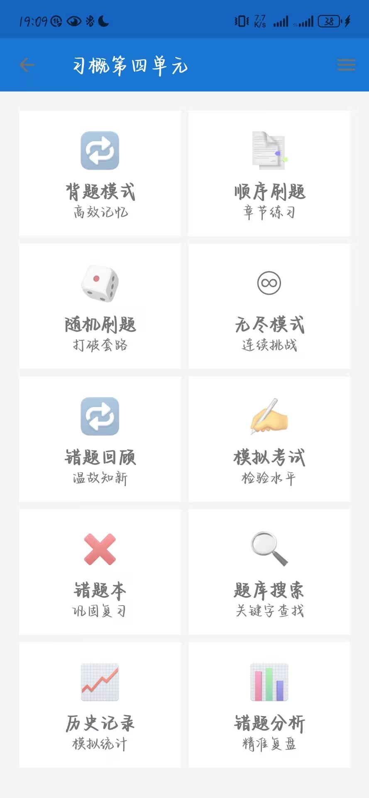
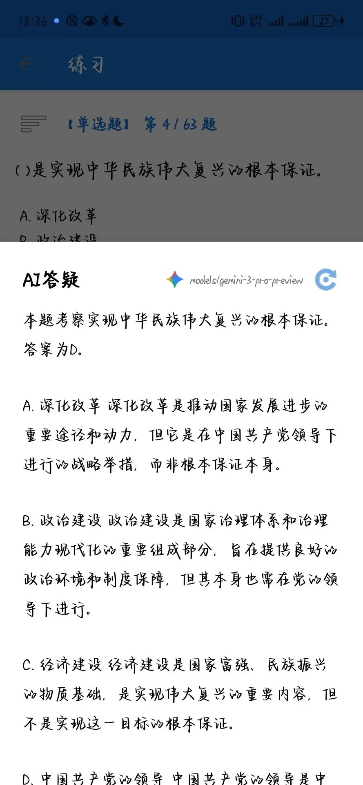
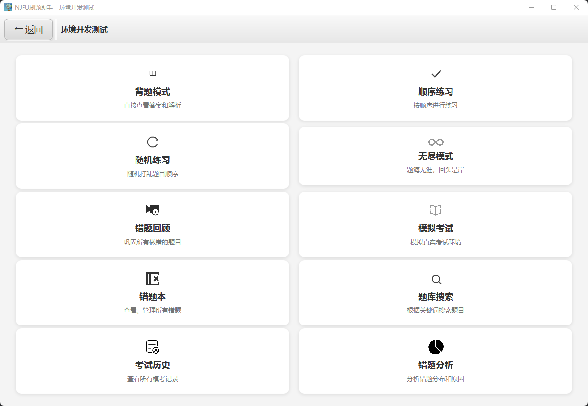
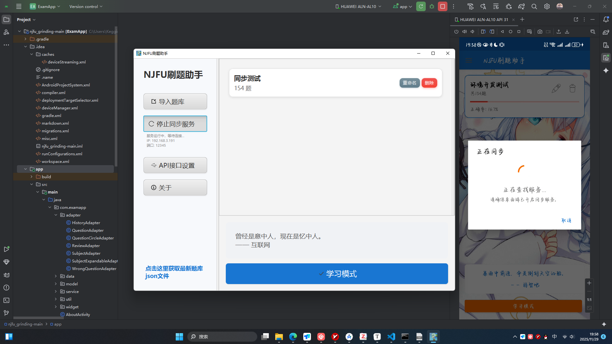

<p align="center">
    <a href="https://github.com/keggin-CHN/njfu_grinding">
        
    </a>
    <a href="https://github.com/keggin-CHN/njfu_grinding">
        
    </a>
    <a href="https://github.com/keggin-CHN/njfu_grinding/issues">
        
    </a>
</p>

# 南京林业大学马院刷题系统
如果本项目对你有帮助，请点个 Star ⭐。(づ｡◕‿‿◕｡)づ

BUG问题可提交issue，也可联系本人: admin@mail.keggin.me

关于马院系统的平时作业秒杀油猴插件移步作者的另一仓库:https://github.com/keggin-CHN/njfu-exam

最新版刷题安卓APP下载地址:https://github.com/keggin-CHN/njfu_grinding/releases/download/all/NJFU.grinding.apk

最新版windows PC版下载地址:https://github.com/keggin-CHN/njfu_grinding/releases/download/all/NJFU.grinding.rar （下载完成后解压运行exe）

本项目包含三个主要部分：题库爬虫、Android刷题应用和桌面端刷题应用。

## ⚠️ 使用声明

**仅用于学习与技术研究，禁止用于任何商业用途。**

---

## 📦 项目结构

```
njfu_grinding-main/
├── 爬虫/                                    # 题库爬虫模块
│   ├── scraper.py                          # 爬虫主程序
│   ├── Ai-fix.py                           # AI辅助修复脚本
│   ├── requirements.txt                    # Python依赖列表
│   └── README.md                           # 爬虫模块说明
│
├── 题库收集/                                # 收集的题库源文件
│   ├── *.json                              # JSON格式的题库文件
│   └── README.md                           # 题库收集说明
│
├── app/                                    # Android应用源码
│   ├── src/main/
│   │   ├── java/com/examapp/              # Java源代码
│   │   │   ├── adapter/                   # 列表适配器
│   │   │   ├── data/                      # 数据管理层
│   │   │   ├── model/                     # 数据模型
│   │   │   ├── service/                   # 后台服务
│   │   │   ├── util/                      # 工具类
│   │   │   ├── widget/                    # 自定义控件
│   │   │   └── *.java                     # Activity类
│   │   │
│   │   ├── res/                           # 资源文件
│   │   │   ├── drawable/                  # 图片资源
│   │   │   ├── layout/                    # 布局文件
│   │   │   ├── menu/                      # 菜单资源
│   │   │   ├── values/                    # 值资源
│   │   │   └── xml/                       # XML配置
│   │   │
│   │   └── AndroidManifest.xml            # 应用清单文件
│   │
│   └── build.gradle                       # 应用构建配置
│
├── desktop/                                # 桌面应用源码 (JavaFX)
│   ├── src/main/
│   │   ├── java/com/examapp/              # Java源代码
│   │   │   ├── controller/              # FXML控制器
│   │   │   ├── data/                      # 数据管理
│   │   │   ├── model/                     # 数据模型
│   │   │   ├── service/                   # 后台服务
│   │   │   └── util/                      # 工具类
│   │   │
│   │   └── resources/                     # 资源文件
│   │       ├── fxml/                      # FXML布局文件
│   │       ├── images/                    # 图片资源
│   │       └── css/                       # 样式表
│   │
│   └── pom.xml                            # Maven项目配置
│
├── figures/                                # 项目截图
│
├── build.gradle                           # 项目构建配置
├── settings.gradle                        # 项目设置
├── gradle.properties                      # Gradle属性
├── gradlew                                # Gradle包装器脚本(Unix)
├── gradlew.bat                            # Gradle包装器脚本(Windows)
├── .gitignore                             # Git忽略配置
├── LICENSE                                # 开源许可证
└── README.md                              # 项目说明文档
```

---

## 📊 题库爬虫

基于 Selenium 的自动化题库爬虫工具,用于从南林考试系统抓取题目数据,并进行数据分析和可视化。

最终输出结果包含题库的题目，选项与答案。
### 使用方法

#### 1. 环境准备

```bash
cd 爬虫
pip install -r requirements.txt
```

#### 2. 配置爬虫参数

编辑 `scraper.py` 文件,修改以下配置:

```python
USERNAME = "你的用户名"          # 登录用户名
PASSWORD = "你的密码"            # 登录密码
EXAM_URL = "考试页面URL"         # 目标考试的URL
LOOP_COUNT = 50                  # 循环抓取次数
USE_EDGE = True                  # True使用Edge浏览器, False使用Chrome
HEADLESS = False                 # True为无头模式(不显示浏览器窗口)
```

#### 3. 运行爬虫

```bash
python scraper.py
```

程序会自动:
1. 启动浏览器并登录系统
2. 循环进入考试页面
3. 自动提交试卷
4. 解析报告页面并提取题目
5. 保存到 `question_bank.json`

#### 4. 数据分析与可视化

爬虫运行完成后,会自动生成数据分析报告和可视化图表:

<div align="center">
  
  <p><i>爬虫运行过程 - 实时显示抓取进度和统计信息</i></p>
</div>

<br>

<div align="center">
  
  <p><i>题库增长趋势图 - 展示各类题目数量随循环次数的变化</i></p>
</div>

### 主要功能

- 🔍 **自动化抓取**: 自动登录、进入考试、提交试卷、解析报告
- 📈 **智能去重**: 自动识别并过滤重复题目
- 📊 **实时统计**: 实时显示题库增长情况和分类统计
- 💾 **数据持久化**: 题目自动分类保存为JSON格式
- 🔄 **增量更新**: 支持断点续爬,新题目自动追加到题库
- 📉 **可视化分析**: 自动生成题库增长趋势图表

### 技术栈

- **Selenium**: 浏览器自动化控制
- **BeautifulSoup**: HTML页面解析
- **Matplotlib**: 数据可视化
- **WebDriver Manager**: 自动管理浏览器驱动

### 📖 详细文档

<h3>更多有关爬虫的原理、细节、操作方案见个人博客: <a href="https://keggin.me/archives/5d7289ad-5e2e-4bde-a5f3-159e2b56e457">点击查看</a></h3>

---

## 📱 Android刷题应用

一款功能强大的Android刷题应用,支持多种学习模式和AI智能助手功能。

<div align="center">
  
  
  <p><i>应用界面展示</i></p>
</div>

### 核心功能

- 📚 **多种学习模式**
  - 顺序练习
  - 随机练习
  - 模拟考试
  - 无尽模式
  
- 🤖 **AI智能助手**
  - 支持多个AI服务商(ChatGLM, Claude, DeepSeek, Gemini, Grok, Ollama, OpenAI, Qwen)
  - 用于个性化学习建议与答疑
  
- 📊 **学习数据分析**
  - 答题历史记录
  - 错题本管理
  - 学习进度追踪
  - 成绩统计图表

- 🔍 **题目管理**
  - 题目搜索
  - 分类浏览
  - 题目收藏
  - 自定义导入

### 技术特性

- 基于Android原生开发
- Material Design设计风格
- 本地数据持久化
- 网络请求与缓存优化
- AI服务集成

### 开发环境

- Android Studio
- Gradle构建系统
- Java开发语言
- Android SDK

---

## 🖥️ 桌面端刷题应用

桌面版刷题应用，提供与移动端相似的体验，方便在PC上进行学习和刷题。

<div align="center">
  
  <p><i>桌面端主界面</i></p>
</div>

<br>

<div align="center">
  
  <p><i>桌面端于安卓端的同步界面</i></p>
</div>

### 核心功能
- 🔄 **数据同步**: 与移动端数据云同步
- ⌨️ **高效操作**: 支持键盘快捷键
- 🎨 **界面优化**: 适配大屏幕，提供更佳阅读体验

---


## 💖 支持项目

开发不易，如果本项目对你有帮助，欢迎 Star ⭐，也欢迎投喂 (๑• . •๑)♡

<div align="center">
  
  <p><i>微信赞赏码</i></p>
</div>

---
## ⭐ Star图

<div align="center">
  <a href="https://api.star-history.com/charts.html?repos=keggin-CHN/njfu_grinding" target="_blank" rel="noopener">
    
  </a>
  <p><i>Star 增长趋势</i></p>
</div>


## 👥 贡献

欢迎提交Issue和Pull Request来帮助改进项目!

---

<div align="center">
  <sub>Built with ❤️ for NJFU students</sub>
</div>


