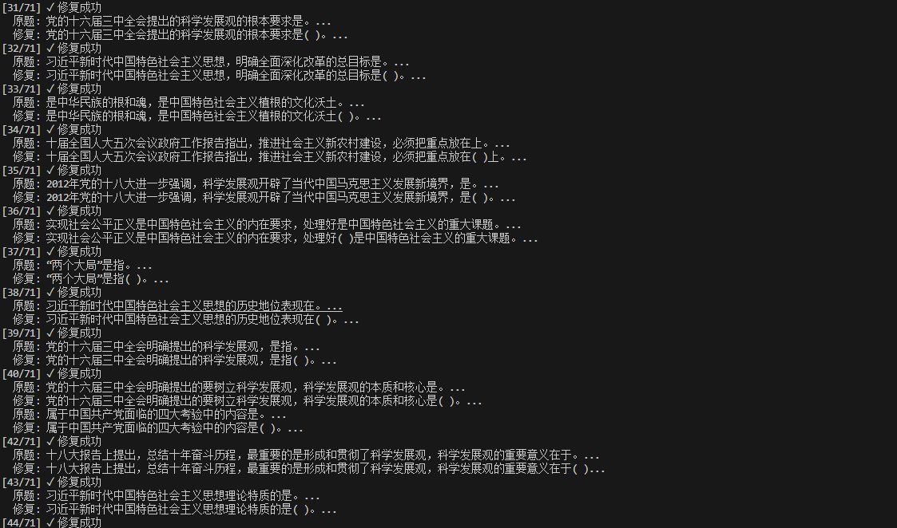
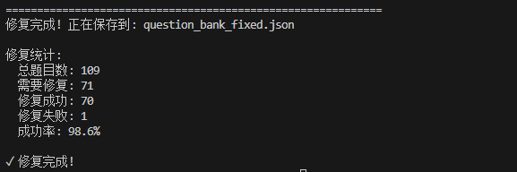

# 南林题库爬取与AI修复工具集

本项目包含两个核心脚本：`scraper.py` 用于从南京林业大学在线考试系统自动化爬取题库数据；`Ai-fix.py` 则是一个高并发的AI工具，用于智能修复题库格式。

---

## 环境与安装

在终端中运行以下命令安装所有必需的库：
```bash
pip install -r requirements.txt
```

---

## 模块一：题库爬虫 (`scraper.py`)

这是一个基于 `Selenium` 的自动化脚本，用于从南京林业大学的在线考试系统中获取原始题库数据。由于其功能特定且涉及登录操作，这里不做详细展开。

感兴趣的用户可以参考以下链接了解其实现细节和原理：

- **项目介绍与演示**: [https://github.com/keggin-CHN/njfu_grinding/blob/main/README.md](https://github.com/keggin-CHN/njfu_grinding/blob/main/README.md)
- **技术原理解析**: [https://keggin.me/archives/5d7289ad-5e2e-4bde-a5f3-159e2b56e457](https://keggin.me/archives/5d7289ad-5e2e-4bde-a5f3-159e2b56e457)

---

## 模块二：AI 高并发题库修复 (`Ai-fix.py`)

由于题库本身问题，通过爬虫获取的题库，经常存在格式不统一的问题（如缺少填空括号）。手动修复成百上千道题目费时费力。`Ai-fix.py` 的设计目标就是解决这个问题。

它的核心优势不在于依赖某个强大的特定AI模型，而在于 **速度和吞吐量**。脚本通过高并发请求，可以在短时间内处理海量数据，因此它更看重API服务的 **并发能力和Token成本**，而非单次请求的推理能力。一般的模型（如 `Qwen`、`Deepseek` 等）即可满足需求。

### 主要特性

- **高并发处理**: 支持自定义并发数（默认为500），能瞬间产生大量API请求，充分利用API服务能力。
- **智能修复与验证**: 调用AI为题目添加括号，并内置验证逻辑，确保修复结果（只增加一个括号、不修改原文）的准确性。
- **重试机制**: 当AI返回结果不符合要求时，会自动采用更严格的提示词（Prompt）进行重试。
- **模型兼容性**: 支持所有兼容OpenAI聊天API格式的接口。
- **交互式体验**: 启动后会自动检测并列出可用模型供用户选择，并引导用户输入文件路径。

### 使用方法

1.  **配置API**: 打开 `Ai-fix.py` 文件，填入你的API信息：

    ```python
    # ==================== 配置区域 ====================
    API_BASE_URL = "https://your-api-endpoint.com/v1"  # 修改为你的API地址
    API_KEY = "sk-your-api-key"                      # 修改为你的API Key
    CONCURRENCY = 500                                # 并发数，根据你的API服务商限制调整
    # ==================================================
    ```

2.  **运行脚本**: 在终端中执行：

    ```bash
    python Ai-fix.py
    ```

3.  **选择模型与文件**: 脚本会首先连接API，获取并展示所有可用的模型。根据提示，输入数字选择模型，然后指定输入和输出的文件名即可。

    

4.  **开始修复**: 确认后，脚本将以设定的并发数开始全速修复题库。终端会实时展示修复进度。

    

---
## 注意事项

- **API成本**: 高并发会快速消耗API的Tokens，请注意你的账户额度和费用。
- **合法性与风险**: `scraper.py` 脚本仅供学习和技术研究。自动化操作可能对目标服务器造成影响，请自行承担使用风险。
